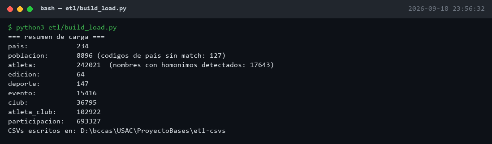
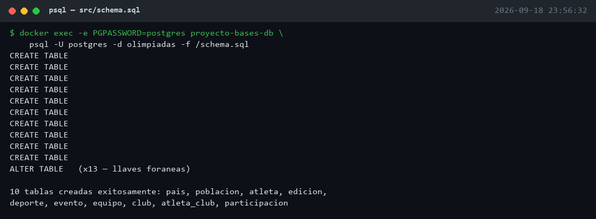
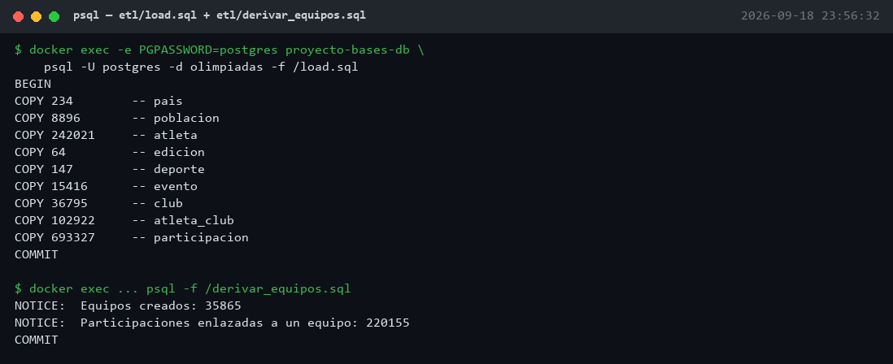
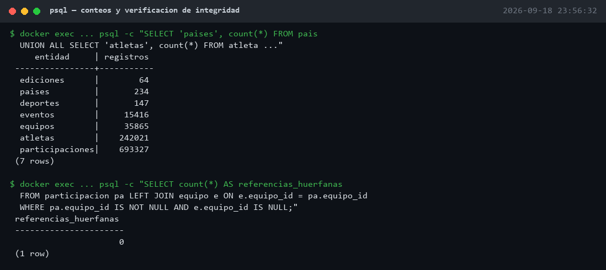
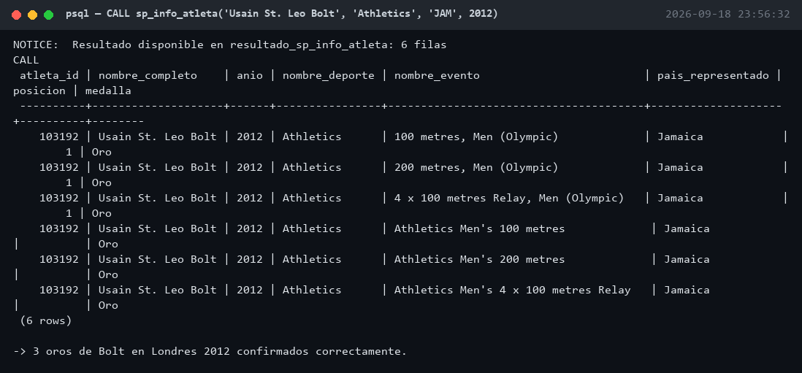
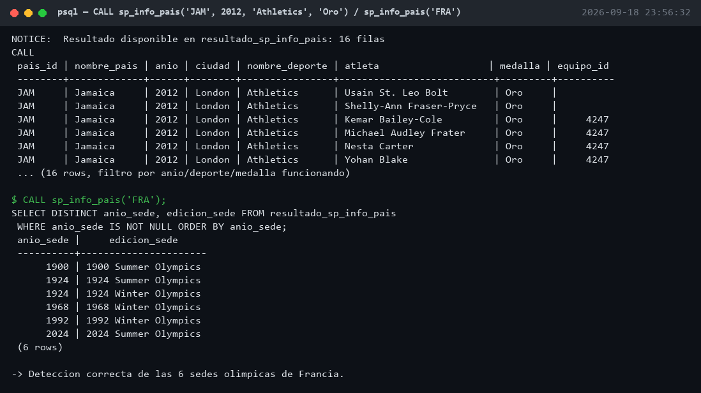

# Evidencia de ejecución

Capturas de la ejecución completa del pipeline en un entorno limpio (contenedor
recreado desde cero con `docker compose down -v`), realizadas el **2026-09-18**.
Siguen el orden descrito en [`etl/run_load.sh`](../etl/run_load.sh) y confirman
que los conteos coinciden con los reportados en [`informe.md`](../informe.md).

Cada sección incluye el comando exacto para reproducirlo, en **PowerShell**
(la shell por defecto en Windows), ejecutado desde la raíz del repo con
Docker corriendo. Es el mismo procedimiento que automatiza
`etl/run_load.sh` (pensado para bash/Git Bash), pero paso a paso para poder
capturar cada resultado por separado.

## 0. Preparar el entorno

```powershell
docker compose down -v --remove-orphans
docker compose up -d db

do {
    docker exec proyecto-bases-db pg_isready -U postgres -d olimpiadas | Out-Null
    $ready = $LASTEXITCODE -eq 0
    if (-not $ready) { Start-Sleep -Seconds 1 }
} until ($ready)
```

## 1. Extracción y transformación (`etl/build_load.py`)

```powershell
python3 etl/build_load.py
```



Genera los CSVs intermedios en `etl-csvs/` a partir de las 7 fuentes: 242,021
atletas y 693,327 participaciones deduplicadas, tal como se documenta en la
sección 6 de `informe.md`.

## 2. Creación del esquema (`src/schema.sql`)

```powershell
docker cp src/schema.sql proyecto-bases-db:/schema.sql
docker exec -e PGPASSWORD=postgres proyecto-bases-db psql -U postgres -d olimpiadas -v ON_ERROR_STOP=1 -f /schema.sql
```



Las 10 tablas del modelo (`pais`, `poblacion`, `atleta`, `edicion`, `deporte`,
`evento`, `equipo`, `club`, `atleta_club`, `participacion`) y sus llaves
foráneas se crean sin errores sobre un Postgres 16 recién levantado.

## 3. Carga de datos y derivación de equipos (`etl/load.sql` + `etl/derivar_equipos.sql`)

```powershell
docker exec proyecto-bases-db mkdir -p /data
docker cp etl-csvs/. proyecto-bases-db:/data
docker cp etl/load.sql proyecto-bases-db:/load.sql
docker exec -e PGPASSWORD=postgres proyecto-bases-db psql -U postgres -d olimpiadas -v ON_ERROR_STOP=1 -f /load.sql

docker cp etl/derivar_equipos.sql proyecto-bases-db:/derivar_equipos.sql
docker exec -e PGPASSWORD=postgres proyecto-bases-db psql -U postgres -d olimpiadas -v ON_ERROR_STOP=1 -f /derivar_equipos.sql
```



Cada `COPY` coincide con el resumen del ETL. La derivación de equipos crea
35,865 equipos y enlaza 220,155 participaciones de eventos colectivos
(relevos, deportes de equipo).

## 4. Creación de los stored procedures (`src/stored_procedures.sql`)

```powershell
docker cp src/stored_procedures.sql proyecto-bases-db:/stored_procedures.sql
docker exec -e PGPASSWORD=postgres proyecto-bases-db psql -U postgres -d olimpiadas -v ON_ERROR_STOP=1 -f /stored_procedures.sql
```

Crea `sp_info_atleta` y `sp_info_pais` sin errores (`CREATE PROCEDURE` x2).

## 5. Verificación de integridad

```powershell
$sql = @'
SELECT 'paises' AS entidad, count(*) AS registros FROM pais
UNION ALL SELECT 'atletas', count(*) FROM atleta
UNION ALL SELECT 'ediciones', count(*) FROM edicion
UNION ALL SELECT 'deportes', count(*) FROM deporte
UNION ALL SELECT 'eventos', count(*) FROM evento
UNION ALL SELECT 'equipos', count(*) FROM equipo
UNION ALL SELECT 'participaciones', count(*) FROM participacion;
'@
docker exec -e PGPASSWORD=postgres proyecto-bases-db psql -U postgres -d olimpiadas -c $sql

$sql = @'
SELECT count(*) AS referencias_huerfanas
FROM participacion pa
LEFT JOIN equipo e ON e.equipo_id = pa.equipo_id
WHERE pa.equipo_id IS NOT NULL AND e.equipo_id IS NULL;
'@
docker exec -e PGPASSWORD=postgres proyecto-bases-db psql -U postgres -d olimpiadas -c $sql
```



Conteo final por tabla y comprobación de que no existen participaciones con
`equipo_id` huérfano (0 referencias huérfanas), replicando las consultas de
[`ejemplos.md`](../ejemplos.md).

## 6. `sp_info_atleta`

```powershell
$sql = @'
CALL sp_info_atleta('Usain St. Leo Bolt', 'Athletics', 'JAM', 2012);
SELECT atleta_id, nombre_completo, anio, nombre_deporte, nombre_evento, pais_representado, posicion, medalla
FROM resultado_sp_info_atleta;
'@
docker exec -e PGPASSWORD=postgres proyecto-bases-db psql -U postgres -d olimpiadas -c $sql
```



Filtra correctamente por deporte, país y año, devolviendo las 3 pruebas en
las que ganó oro en Londres 2012 (100m, 200m y relevo 4x100m), duplicadas
porque dos fuentes distintas (`athlete_events.csv` y `results.csv`) aportan
cada una su propio renglón para el mismo resultado.

## 7. `sp_info_pais`

```powershell
$sql = @'
CALL sp_info_pais('JAM', 2012, 'Athletics', 'Oro');
SELECT * FROM resultado_sp_info_pais LIMIT 15;
'@
docker exec -e PGPASSWORD=postgres proyecto-bases-db psql -U postgres -d olimpiadas -c $sql

$sql = @'
CALL sp_info_pais('FRA');
SELECT DISTINCT anio_sede, edicion_sede FROM resultado_sp_info_pais
WHERE anio_sede IS NOT NULL ORDER BY anio_sede;
'@
docker exec -e PGPASSWORD=postgres proyecto-bases-db psql -U postgres -d olimpiadas -c $sql
```



El primer `CALL` filtra las medallas de oro de Jamaica en Londres 2012,
incluyendo el equipo de relevo derivado (`equipo_id = 4247`). El segundo
confirma que el procedimiento detecta correctamente las 6 ediciones en las
que Francia fue sede (1900, 1924 verano e invierno, 1968, 1992 y 2024).

## Alternativa: todo en un solo paso (Git Bash / WSL)

Si prefieres correrlo con un solo script en vez de comando por comando,
`etl/run_load.sh` hace los pasos 0 a 4 automáticamente y deja abierta una
sesión de `psql` para correr las consultas de las secciones 5 a 7 (o las de
[`ejemplos.md`](../ejemplos.md)) de forma interactiva. Requiere bash (Git
Bash o WSL), no PowerShell:

```bash
python3 etl/build_load.py
bash etl/run_load.sh
```
